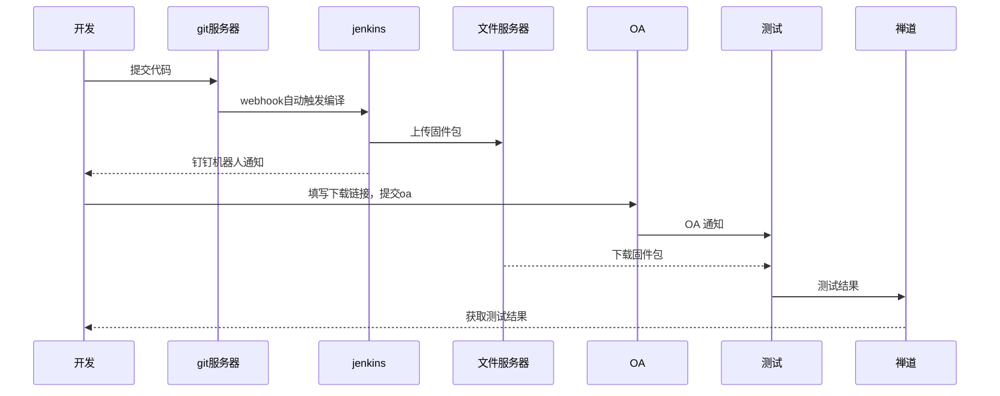
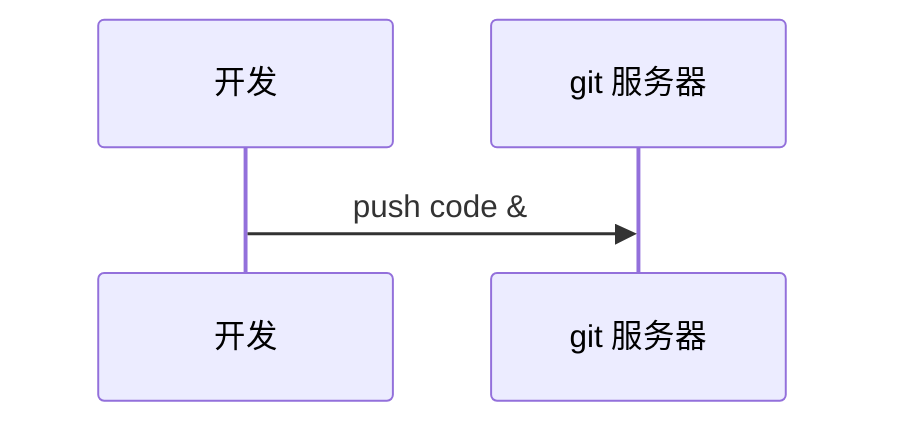

# 第一阶段规划

# 第二阶段规划

##### 版本号规则

- 当前是   应用（版本号+时间）+ AF(版本号+时间)

- 需要在每一次编译时在最后面加一，比如： UV430_12X__V1.1.0_R_2022422_9.mrg

- 需要确认：
  
  - 应用版本的规则
  
  - 单片机版本的规则

##### 固件归档

建议: 目前的应用和单片机版本号不做变动，由jenkins在编译之后，整合应用、单片机，修改记录的压缩包，名称变更为最新规则。

- 文件服务器中的文件为一个压缩包，包含应用，单片机，修改记录(只能拿到git中的提交记录)

- 文件服务器会自动覆盖文件名称相同的的文件

- 分为release和debug目录，release目录存放已经发布的，保留历史记录。debug存放测试版本，只保留最新三个版本(或者多个版本)。

- 问题点：
  
  - 多次提交编译，只能获取到当前最新的提交记录，不完整。可以变更信息文件存放到代码目录中

##### 修改日志

- 由开发写到文本中

##### 单片机程序依赖

- 提供一个工具供(web或客户端)单片机工程师上传

- 应用这边在使用时，写一个依赖文件，在编译时按照规则下载并放到相应的目录

##### 改名称

- debug 目录中的程序在经过测试之后，可以变更为release版本(人工操作)

##### 程序下发

- 实现

##### 第一阶段

- 实现代码的自动化编译

- 代码从svn迁移到git

##### 第二阶段

- 文件服务器开发，实现文件归档，下载，浏览，改名

- 对接OA系统，开发提交代码之后实现自动提交OA

- 程序下发，邮件通知

因为当前系统只满足第一阶段功能需求，短时间内无法完成程序下发和文件归档功能，需要后续对系统进行二次开发
